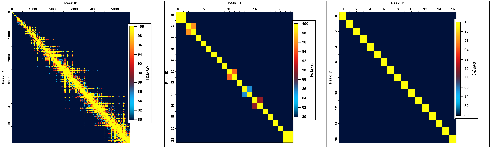
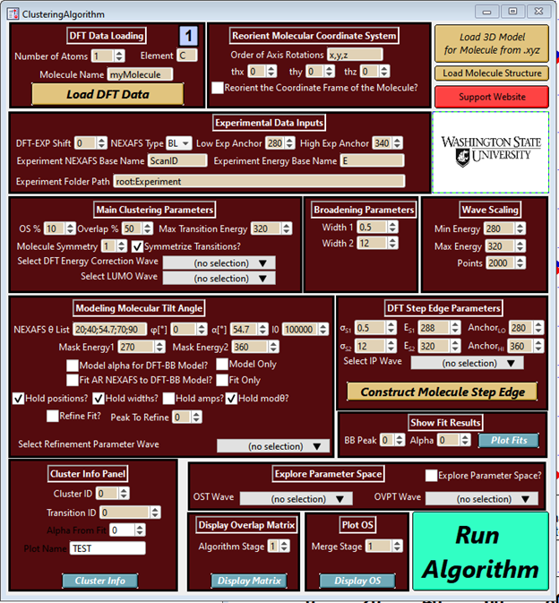

# DFT-Clustering
This code allows one to take a DFT calculation using the computatational platform StoBe of NEXAFS spectra. The result is a set of peaks that make up a Building Block model using a tensor based formalism that can be used to carry out simultaneous fits on angle resolved NEXAFS for the extraction of the molecular tilt angle. These peaks can then be used to obtain optical constants that could be subsequently used in the analysis of Resonant Soft X-Ray Scattering (R-SoXS) and Resonant X-Ray Reflectivity (XRR).

  

The algorithm works by defining the following parameters:
1. An energy cutoff that defines what is the maximum DFT transition energy to consider
2. An oscillator strength threshold that filters transitions that do not have a sufficiently high intensity from subsequent steps
3. A peak overlap threshold that determines whether two transitions can be clustered together depending on the overlap area between them. 

The code runs on IGOR 8, however a Python implementation may be developed in the future. Also, the code takes StoBe output files as input, however, as long as the computational platform provides transition energies, transition intensities and the components of the transition dipole moment, then the loading function can be modified to accomodate other platforms. 

  

The accompanying python files are there to:
1. Facilitate the procedural generation of the .run files for a Transition Potential calculation carried out in StoBe 
2. Extract the Mulliken Population Analysis from the StoBe output files that can be subsequently loaded into IGOR to aid in the chemical characterization of NEXAFS transitions. 
 
 Setup
1. Navigate to the following directory: Documents > Wavemetrics > Igor Pro 8 User Files
2. Place the file clusteringPanel v1.ipf in the folder named "Igor Procedures"
3. Navigate to the folder Documents > Wavemetrics > Igor Pro 8 User Files > User Procedures  
4. Place the contents of the folder "DFT_Clustering" inside the "User Procedures" directory
5. Open an IGOR instance. There should be a tab titled Macros there. Within the dropdown menu in Macros there should be an option titled "Clustering Algorithm" which will load in the control panel for the algorithm.

Bug reporting/Help
For any concerns email me at victor.murcia@wsu.edu
